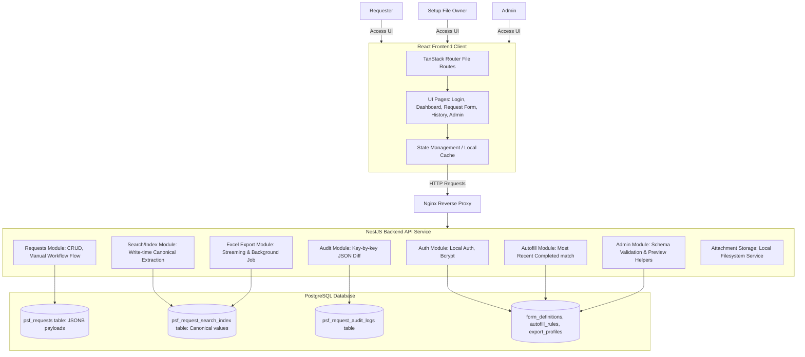

# PSF Setup File Web Application

This repository contains the architecture, specification, and codebase for the **PSF Setup File Request Management Web Application**. The system streamlines the workflow of submitting PSF requests, managing dynamic form schemas, tracking setup status, performing search indexing, auto-filling fields, auditing changes, and exporting reports.

---

## 🗺️ System Architecture

The application is built on a modular architecture leveraging a file-based React frontend and a TypeScript-based NestJS backend, backed by PostgreSQL.



---

## 📂 Project Organization

The repository is structured to separate frontend and backend concerns clearly, facilitating clean dependencies and organized deployments:

```text
/
├── CONTEXT.md                              # Ubiquitous Domain Glossary & Language rules
├── psf_setup_file_web_application_spec_en.md # Full Web Application Product Specification
├── docs/
│   └── adr/                                # Architectural Decision Records (ADRs)
│       ├── 0001-nestjs-postgresql-backend.md
│       ├── 0002-draft-form-version-upgrade.md
│       ├── ...
│       └── 0013-excel-export-schema-alignment.md
├── frontend/                               # React UI Application (Vite / TS)
│   ├── src/
│   │   ├── routes/                         # Route components (Login, Dashboard, Admin, etc.)
│   │   ├── components/                     # Reusable UI components
│   │   └── services/                       # API clients and query managers
│   └── package.json
└── backend/                                # Backend API Service (NestJS / TS)
    ├── src/                                # NestJS Domain Modules
    │   ├── auth/
    │   ├── requests/
    │   ├── audit/
    │   ├── export/
    │   ├── database/
    │   └── admin/
    └── package.json
```

---

## 🛠️ Tech Stack & Key Choices

The core technologies selected for the MVP are:

* **Frontend**: React, TanStack Start/Router, Vite, TypeScript, Vanilla CSS.
* **Backend API**: NestJS (TypeScript) with Fastify (or Express) adapter.
* **Database**: PostgreSQL (using `JSONB` for schema flexibility and index tables for performance).
* **Reverse Proxy**: Nginx (handling static asset routing and local API proxying).
* **Storage**: Local Server filesystem with abstract `AttachmentService` for future Cloud Storage migration.
* **Authentication**: Local Database Authentication (Username/Password with Bcrypt hashing and secure HttpOnly cookie sessions).

---

## 📚 Key Architectural Decisions (ADRs)

Detailed rationales for key technical decisions are recorded in the [docs/adr/](file:///c:/Users/nxg22301/Desktop/Anti_Folder/Web_setup_file/docs/adr/) directory:

| Record | Title | Summary |
|---|---|---|
| [ADR 0001](file:///c:/Users/nxg22301/Desktop/Anti_Folder/Web_setup_file/docs/adr/0001-nestjs-postgresql-backend.md) | NestJS and PostgreSQL Backend | Chose NestJS + PostgreSQL over Rust Axum for dev speed and TypeScript tooling alignment. |
| [ADR 0002](file:///c:/Users/nxg22301/Desktop/Anti_Folder/Web_setup_file/docs/adr/0002-draft-form-version-upgrade.md) | Draft Form Version Upgrade | Hybrid approach prompting users to upgrade draft schemas or remain on the snapshot. |
| [ADR 0004](file:///c:/Users/nxg22301/Desktop/Anti_Folder/Web_setup_file/docs/adr/0004-write-time-canonical-extraction.md) | Write-Time Canonical Extraction | Extracted index keys at write-time into a flat table to guarantee fast sorting and exporting. |
| [ADR 0005](file:///c:/Users/nxg22301/Desktop/Anti_Folder/Web_setup_file/docs/adr/0005-manual-workflow-status-transitions.md) | Manual Status Transitions | Workflow transitions are manual actions configured dynamically by administrators. |
| [ADR 0006](file:///c:/Users/nxg22301/Desktop/Anti_Folder/Web_setup_file/docs/adr/0006-local-database-authentication.md) | Local Database Authentication | Username/Bcrypt login for MVP to eliminate third-party credentials configuration overhead. |
| [ADR 0007](file:///c:/Users/nxg22301/Desktop/Anti_Folder/Web_setup_file/docs/adr/0007-admin-json-schema-editor.md) | Admin JSON Schema Editor | Integrated Monaco/CodeMirror editor with visual preview panel, avoiding visual builder complexity. |
| [ADR 0008](file:///c:/Users/nxg22301/Desktop/Anti_Folder/Web_setup_file/docs/adr/0008-local-filesystem-attachment-storage.md) | Local Filesystem Attachment Storage | Stores uploaded spec sheets locally with metadata in PostgreSQL, abstracted for future S3 migration. |
| [ADR 0009](file:///c:/Users/nxg22301/Desktop/Anti_Folder/Web_setup_file/docs/adr/0009-autofill-resolution-strategy.md) | Auto-fill Duplicate Resolution | Resolves duplicate trigger fields using the most recent completed request (`completed_at DESC`). |
| [ADR 0010](file:///c:/Users/nxg22301/Desktop/Anti_Folder/Web_setup_file/docs/adr/0010-shared-setup-queue-visibility.md) | Shared Queue Model for Owners | Setup File Owners have full visibility over all requests to maximize team throughput. |
| [ADR 0011](file:///c:/Users/nxg22301/Desktop/Anti_Folder/Web_setup_file/docs/adr/0011-key-by-key-diff-request-audit-logs.md) | Key-by-Key Diff Audit Logging | Audits dynamic JSON changes at the granular field-key level during writes for single-request logs. |
| [ADR 0012](file:///c:/Users/nxg22301/Desktop/Anti_Folder/Web_setup_file/docs/adr/0012-schema-embedded-master-data.md) | Schema-Embedded Master Data | Embeds master data reference lists inside the JSON Form Schema definitions to avoid relational tables. |
| [ADR 0013](file:///c:/Users/nxg22301/Desktop/Anti_Folder/Web_setup_file/docs/adr/0013-excel-export-schema-alignment.md) | Excel Export Layout Strategy | Aligns columns to latest schema using canonical mapping and hides unauthorized fields dynamically. |

---

## 📖 Glossary

Refer to [CONTEXT.md](file:///c:/Users/nxg22301/Desktop/Anti_Folder/Web_setup_file/CONTEXT.md) for standard domain terminology (e.g., *PSF Setup File*, *PSF Request*, *Setup File Owner*, *Canonical Key*, *Search Index*).
