# PSF Setup File — System Diagrams

> Visual diagrams for the PSF Setup File Web Application architecture.
> All diagrams use [Mermaid](https://mermaid.js.org/) syntax and can be rendered in GitHub, GitLab, VS Code, and most modern Markdown viewers.

---

## Table of Contents

- [0. System Architecture](#0-system-architecture)
  - [0.1 Deployment Architecture](#01-deployment-architecture)
  - [0.2 Component Architecture](#02-component-architecture)
  - [0.3 Data Architecture](#03-data-architecture)
  - [0.4 Write Pipeline](#04-write-pipeline)
- [1. System Data Flow](#1-system-data-flow)
- [2. Request Lifecycle State Machine](#2-request-lifecycle-state-machine)
- [3. Sequence Diagrams](#3-sequence-diagrams)
  - [3.1 Login Flow](#31-login-flow)
  - [3.2 Create & Submit PSF Request](#32-create--submit-psf-request)
  - [3.3 Setup Owner Completes PSF Created Information](#33-setup-owner-completes-psf-created-information)
  - [3.4 Auto-fill Flow](#34-auto-fill-flow)
  - [3.5 Excel Export Flow](#35-excel-export-flow)
  - [3.6 Admin: Publish New Form Version](#36-admin-publish-new-form-version)
- [4. Database ER Diagram](#4-database-er-diagram)
- [5. Backend Module Dependency](#5-backend-module-dependency)

---

## 0. System Architecture

> **This is the primary reference diagram for the PSF Setup File system.**
> It shows the deployment topology, component boundaries, data strategy, and cross-cutting concerns.

### 0.1 Deployment Architecture

Three-tier deployment with security boundaries: **Client → Reverse Proxy → Application → Database**.

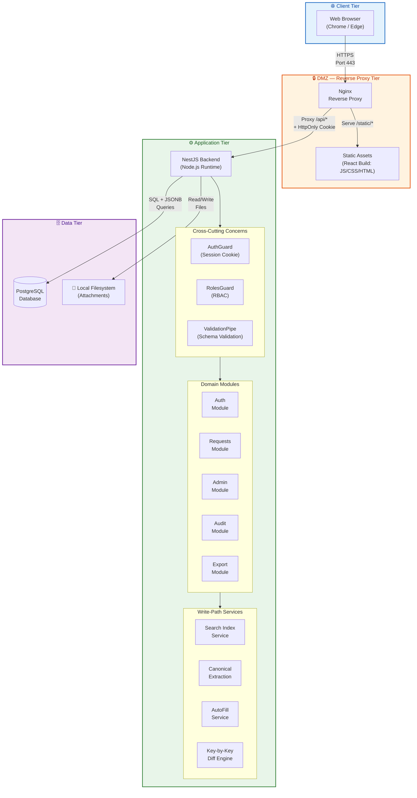

**Key Architecture Decisions reflected here:**

| Concern | Decision | ADR |
|---|---|---|
| Backend Framework | NestJS + TypeScript | [ADR-0001](../docs/adr/0001-nestjs-postgresql-backend.md) |
| Authentication | Local DB auth, Bcrypt, HttpOnly cookie | [ADR-0006](../docs/adr/0006-local-database-authentication.md) |
| Attachment Storage | Local filesystem (abstracted for S3 migration) | [ADR-0008](../docs/adr/0008-local-filesystem-attachment-storage.md) |
| Form Admin | JSON Schema Editor (Monaco/CodeMirror) | [ADR-0007](../docs/adr/0007-admin-json-schema-editor.md) |

---

### 0.2 Component Architecture

Internal view of how backend modules, services, and cross-cutting guards interact.

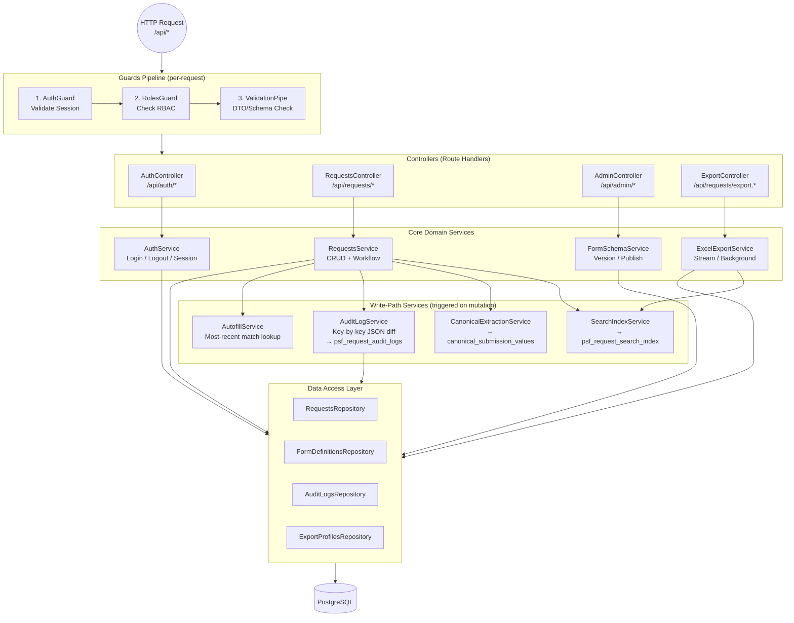

---

### 0.3 Data Architecture

The system uses a **Hybrid Data Strategy** combining flexible JSONB storage with fast indexed columns.
This is one of the most important architectural decisions in the system.

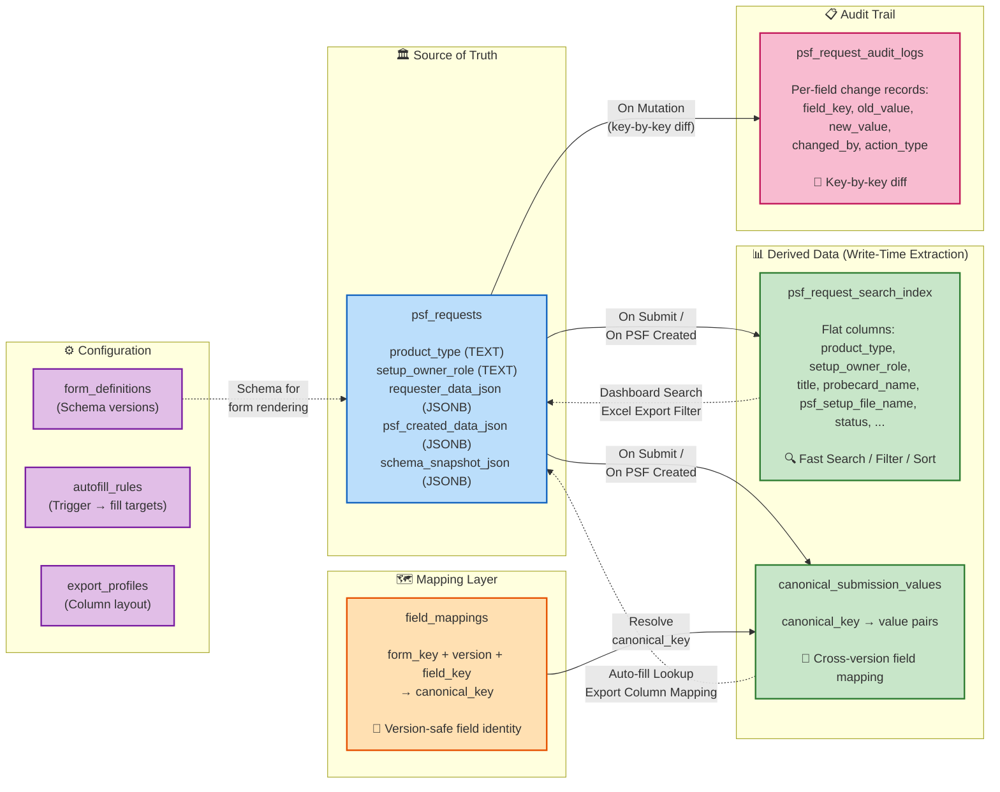

**Key principle:**
- **JSONB is the source of truth** — raw form data is never lost.
- **Derived tables are populated at write time** (not query time) — guarantees O(1) search performance.
- **Canonical keys bridge form versions** — version 1 `psf_name` and version 3 `psf_setup_file_name` resolve to the same canonical key.

---

### 0.4 Write Pipeline

Shows the critical path when a PSF Request is created or updated — the chain of services triggered at write time.

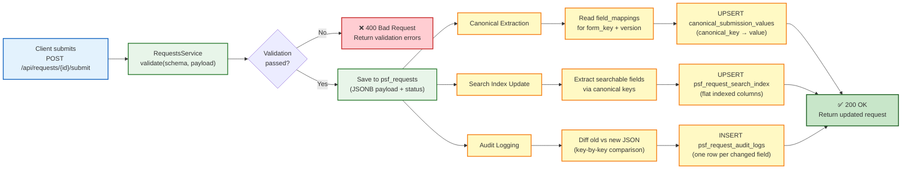

---

## 1. System Data Flow

High-level data flow between actors, the frontend, backend, and the database layer.

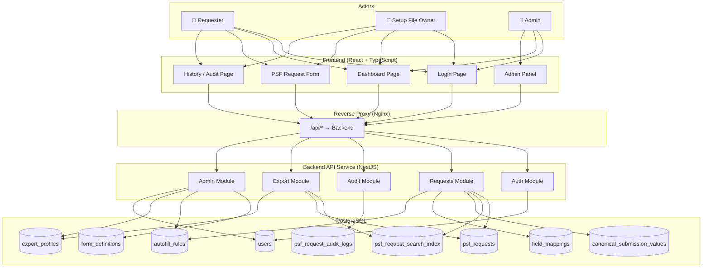

---

## 2. Request Lifecycle State Machine

Shows all valid status transitions, including optional statuses.

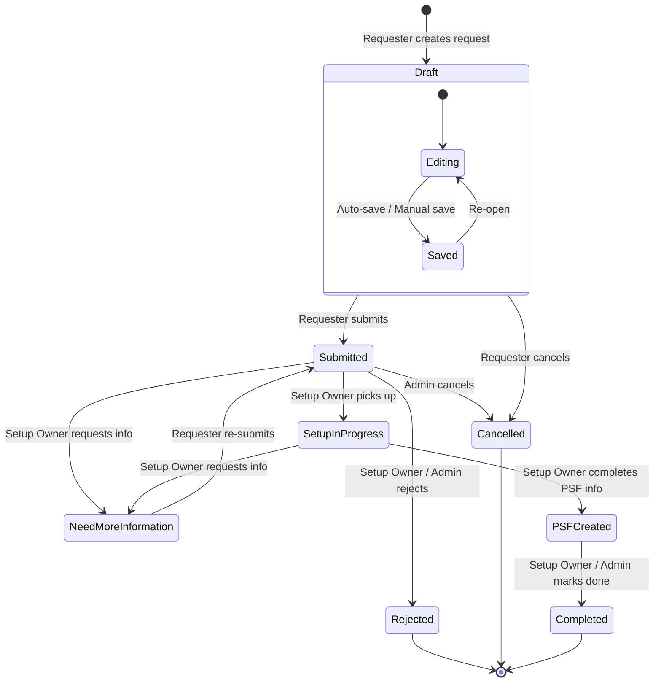

---

## 3. Sequence Diagrams

### 3.1 Login Flow

Local authentication using HttpOnly Secure Cookie (ADR-0006).

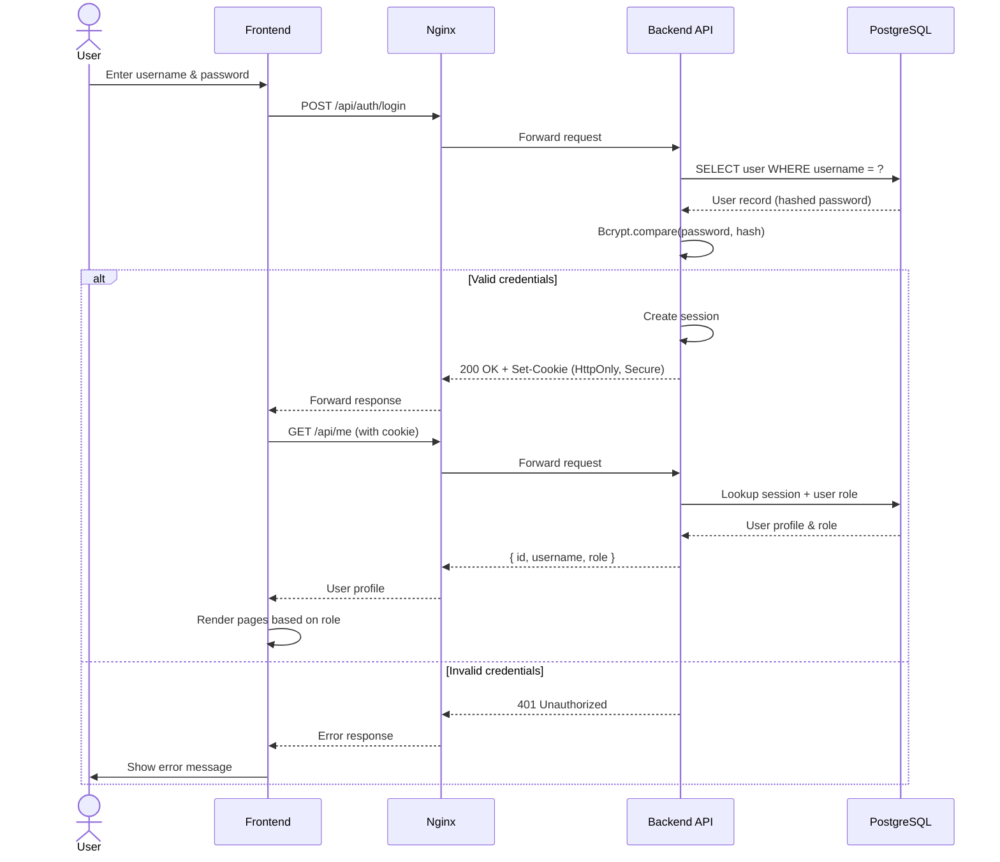

### 3.2 Create & Submit PSF Request

Covers form load, draft save, submission, and write-time canonical extraction.

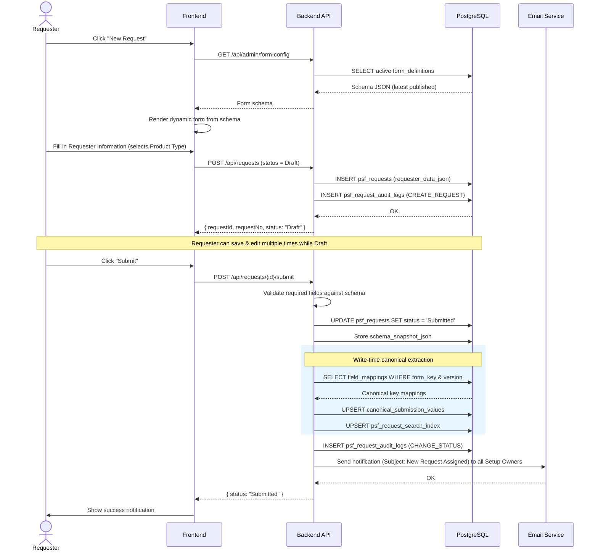

### 3.3 Setup Owner Completes PSF Created Information

Shows the full flow of the Setup Owner picking up, editing, and marking a request as PSF Created.

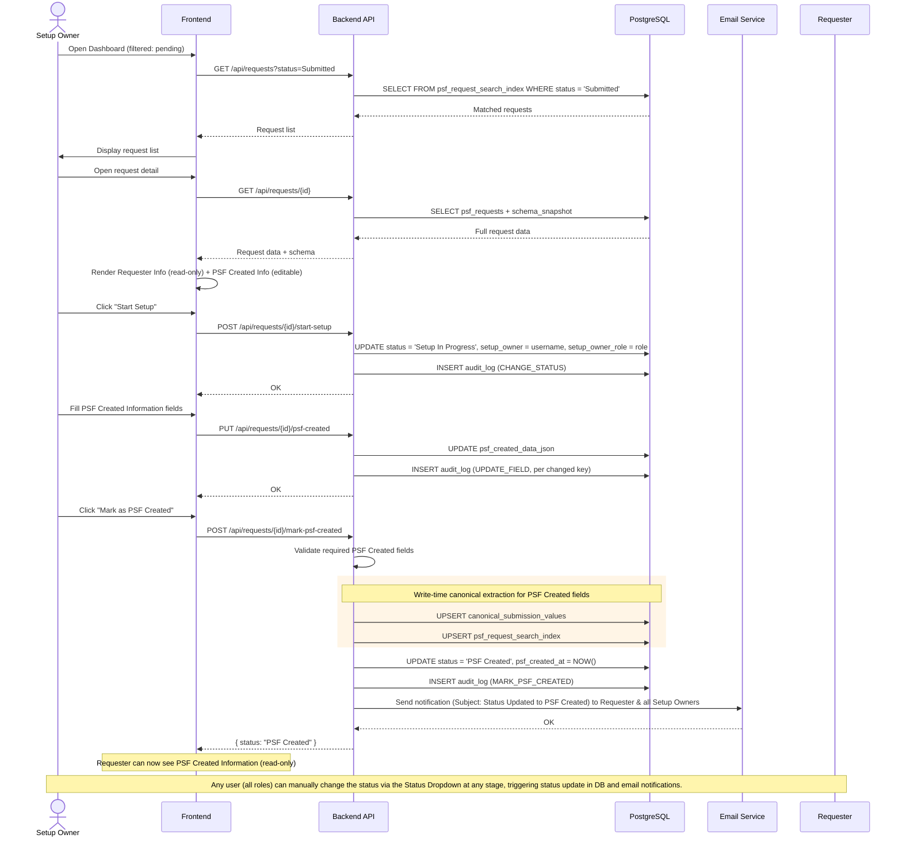

### 3.4 Auto-fill Flow

Shows how auto-fill triggers, resolves conflicts via most-recent-match, and lets the user accept or edit values.

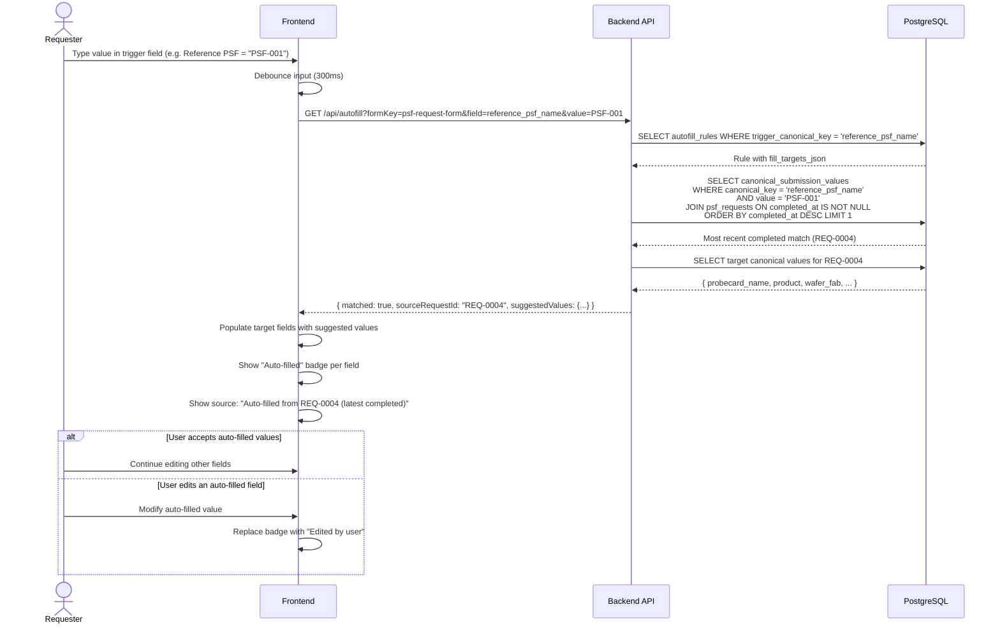

### 3.5 Excel Export Flow

Covers both sync streaming (<2,000 records) and async background job (≥2,000 records) paths, with role-based cell masking.

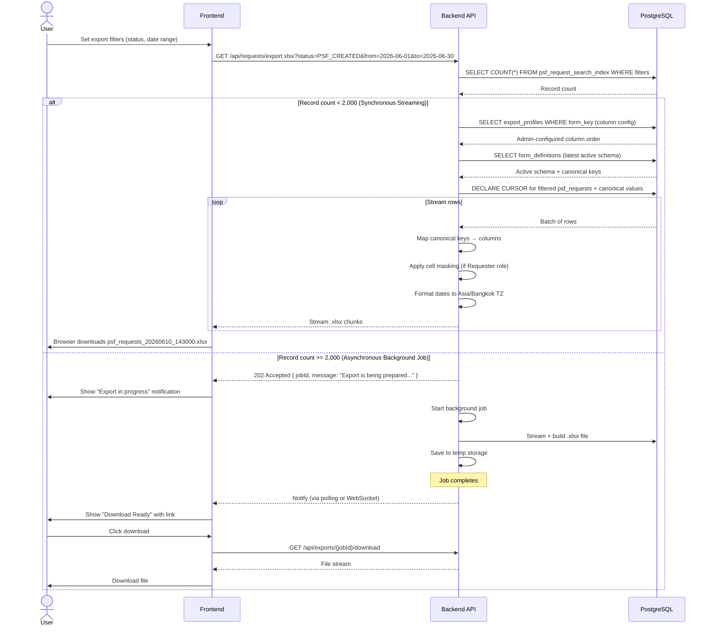

### 3.6 Admin: Publish New Form Version

Shows the workflow for editing a form schema and publishing a new version.

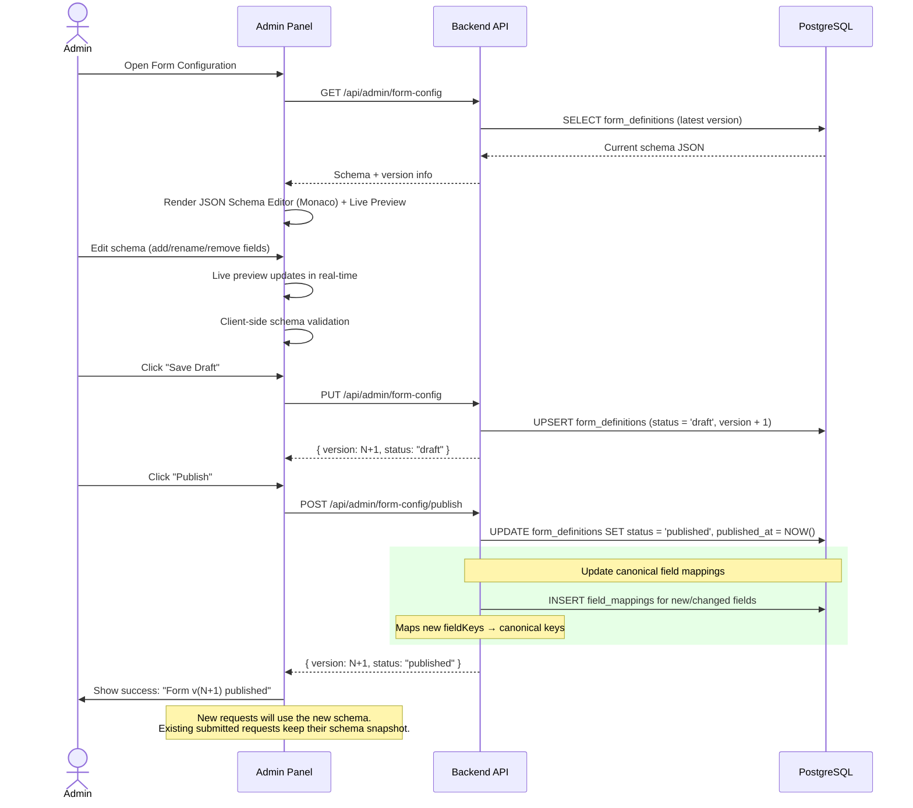

---

## 4. Database ER Diagram

Complete entity-relationship diagram for all tables.

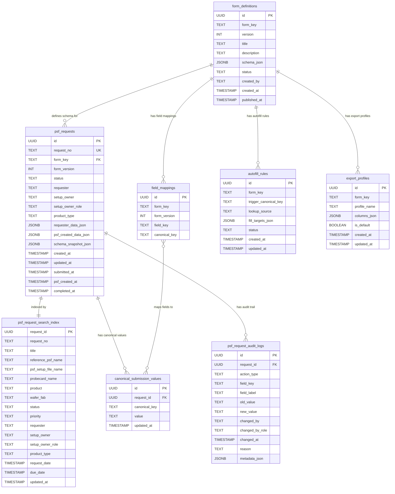

---

## 5. Backend Module Dependency

Shows how NestJS modules depend on each other.

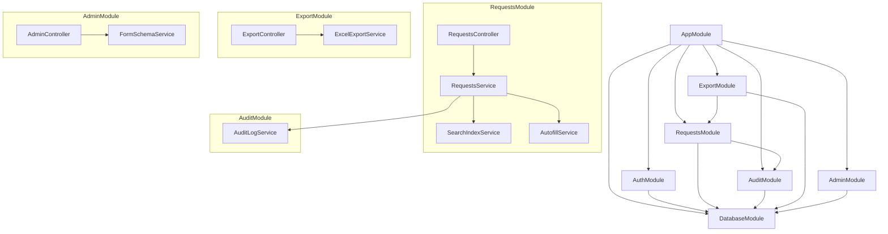

---

## Legend

| Symbol | Meaning |
|---|---|
| `👤` | Human actor |
| `──>>` | Synchronous request |
| `-->>` | Response |
| `rect` | Highlighted operation block |
| `PK` | Primary Key |
| `FK` | Foreign Key |
| `UK` | Unique Key |

---

> **Note**: These diagrams are designed to be rendered by any Mermaid-compatible viewer. For the best experience, view in GitHub, GitLab, or VS Code with a Mermaid extension.
