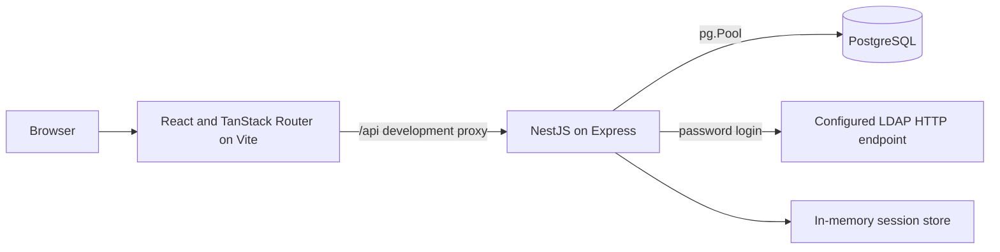
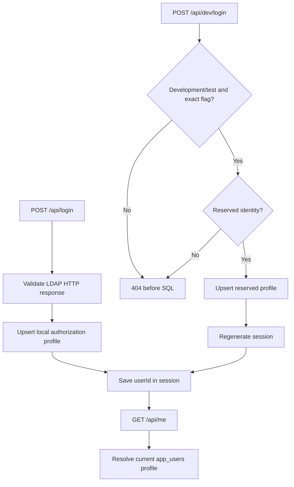
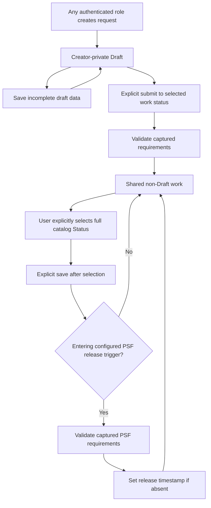
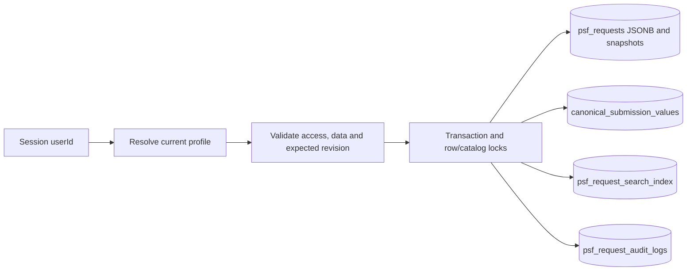
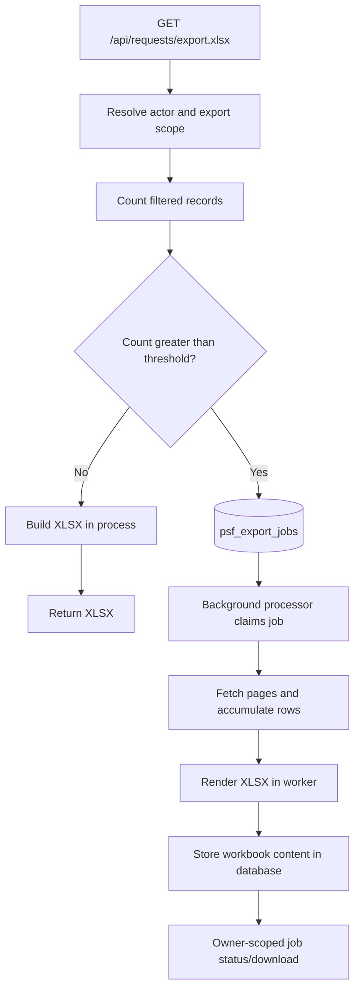

# Current system diagrams

Scope: checked-in `unified-local-auth` behavior audited on 2026-10-02. These
show local development and logical flows, not a verified production deployment
or database foreign-key model. See [current implementation](current-implementation.md)
for route, policy and persistence source references. The original target diagrams
are preserved in [history](history/diagrams-target-architecture.md).

## Local development runtime

```mermaid
flowchart LR
  Browser[Browser] --> Frontend[React and TanStack Router on Vite]
  Frontend -->|/api development proxy| API[NestJS on Express]
  API -->|pg.Pool| DB[(PostgreSQL)]
  API -->|password login| LDAP[Configured LDAP HTTP endpoint]
  API --> Sessions[In-memory session store]
```

Sources: [Vite proxy](../frontend/vite.config.ts),
[bootstrap](../backend/src/main.ts), [pool](../backend/src/database/database.module.ts),
[LDAP service](../backend/src/auth/auth.service.ts).
The frontend may use `VITE_API_BASE_URL`; the proxy shown is Vite development
configuration. Company LDAP connectivity and production reverse proxy are unverified.

## Authentication and profile resolution

```mermaid
flowchart TD
  Password[POST /api/login] --> LDAP[Validate LDAP HTTP response]
  LDAP --> Profile[Upsert local authorization profile]
  Mock[POST /api/dev/login] --> Gate{Development/test and exact flag?}
  Gate -->|No| Deny[404 before SQL]
  Gate -->|Yes| Identity{Reserved identity?}
  Identity -->|No| Deny
  Identity -->|Yes| MockProfile[Upsert reserved profile]
  MockProfile --> Regenerate[Regenerate session]
  Profile --> Save[Save userId in session]
  Regenerate --> Save
  Save --> Me[GET /api/me]
  Me --> Fresh[Resolve current app_users profile]
```

Sources: [auth controller](../backend/src/auth/auth.controller.ts),
[mock controller](../backend/src/auth/development-auth.controller.ts),
[mock service](../backend/src/auth/development-auth.service.ts).
LDAP and mock authentication share profile authorization; only mock login currently
regenerates the session. The frontend hides its mock chooser in production builds.

## Request lifecycle and persistent visibility

```mermaid
flowchart TD
  Create[Any authenticated role creates request] --> Draft[Creator-private Draft]
  Draft --> Save[Save incomplete draft data]
  Save --> Draft
  Draft --> Submit[Explicit submit to selected work status]
  Submit --> Validate[Validate captured requirements]
  Validate --> Shared[Shared non-Draft work]
  Shared --> Choice[User explicitly selects full catalog Status]
  Choice --> Status[Explicit save after selection]
  Status --> Trigger{Entering configured PSF release trigger?}
  Trigger -->|Yes| PsfCheck[Validate captured PSF requirements]
  PsfCheck --> Release[Set release timestamp if absent]
  Trigger -->|No| Shared
  Release --> Shared
```

Sources: [requests](../backend/src/requests/requests.service.ts),
[status catalog](../backend/src/admin/workflow_transition.service.ts).
This is a logical overview, not a stage sequence or automatic workflow. Opening requests, filtering, autofill and saving either form do not change Status. The current catalog strings and no-automation rule are in [the Status contract](status-catalog-and-manual-updates.md).
Catalog kinds are draft/open/completed/cancelled; percentage labels do not impose
progression. The initial release trigger is unconfigured. Once released,
requester PSF visibility persists through later status changes.

## Persistence and mutation flow

```mermaid
flowchart LR
  Session[Session userId] --> Actor[Resolve current profile]
  Actor --> Validation[Validate access, data and expected revision]
  Validation --> Transaction[Transaction and row/catalog locks]
  Transaction --> Request[(psf_requests JSONB and snapshots)]
  Transaction --> Canonical[(canonical_submission_values)]
  Transaction --> Search[(psf_request_search_index)]
  Transaction --> Audit[(psf_request_audit_logs)]
```

Sources: [request transactions](../backend/src/requests/requests.service.ts),
[projections](../backend/src/requests/search-index.service.ts),
[audit records](../backend/src/audit/audit_log.service.ts).
Arrows describe the applicable mutation paths, not a claim that every endpoint
writes all tables. Both form families are stored in `form_definitions`; status
configuration in `workflow_transition_config`; users in `app_users` and rules
in `autofill_rules`. Initializers can create/alter/seed database storage.

## XLSX export

```mermaid
flowchart TD
  Export[GET /api/requests/export.xlsx] --> Policy[Resolve actor and export scope]
  Policy --> Count[Count filtered records]
  Count --> Threshold{Count greater than threshold?}
  Threshold -->|No| Sync[Build XLSX in process]
  Sync --> Download[Return XLSX]
  Threshold -->|Yes| Queue[(psf_export_jobs)]
  Queue --> Poll[Background processor claims job]
  Poll --> Rows[Fetch pages and accumulate rows]
  Rows --> Worker[Render XLSX in worker]
  Worker --> Content[Store workbook content in database]
  Content --> Owner[Owner-scoped job status/download]
```

Sources: [export controller](../backend/src/export/export.controller.ts),
[workbook](../backend/src/export/excel_export.service.ts),
[processor](../backend/src/export/export-job.processor.ts),
[job storage](../backend/src/export/export-job.repository.ts).
Default threshold is 2000; exactly 2000 is synchronous. Export applies requester
PSF masking and is available to Requester/Admin. This is buffered export, not
streaming. No attachment storage or export-profile CRUD flow is shown because
those features are not implemented in the current checkout.
