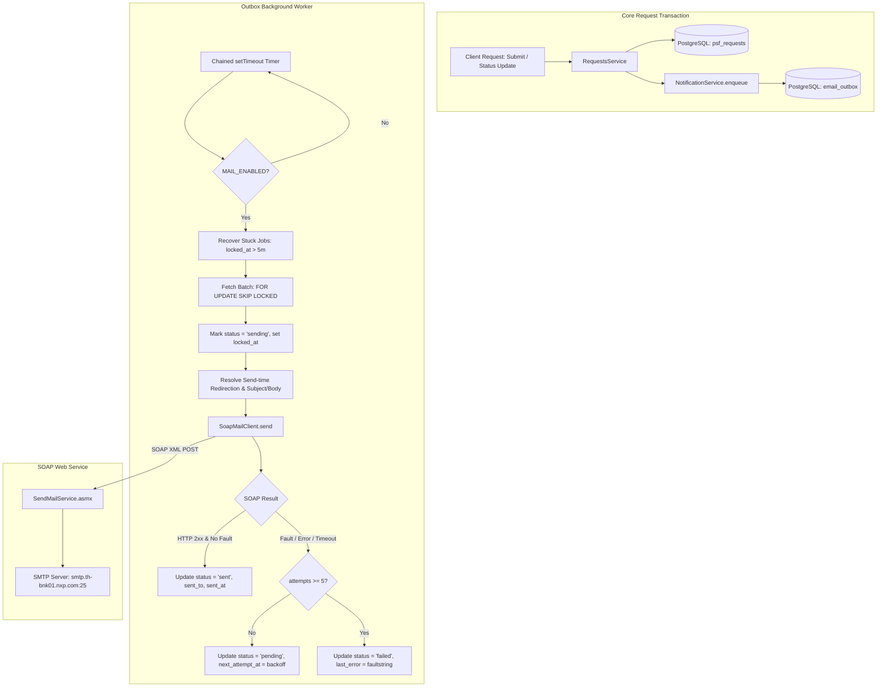

# Design Specification: Email Notification System (SOAP + Outbox)

- **Date:** 2026-10-05
- **Branch:** `feat/email-notification`
- **Scope:** Backend notification outbox, SOAP web service dispatch, email templates, workflow hooks, worker recovery, and admin monitoring API.
- **Reference Tasks:** GI-26 (Notification Outbox & Email Dispatch), Section 7 of `psf_setup_file_web_application_spec_en.md`.

---

## 1. Executive Summary & Goals

The Email Notification System automatically notifies stakeholders (Requesters and Setup File Owners) when PSF requests are submitted or when their workflow status changes. 

To ensure high reliability and responsiveness:
1. **Asynchronous Outbox Pattern:** Request mutations (submission, status transitions) write notification jobs into an `email_outbox` table within the same PostgreSQL transaction. Email sending failures or external network latency never block user actions or roll back business transactions.
2. **Enterprise SOAP Web Service:** Emails are dispatched through NXP's internal `SendMailService.asmx` SOAP web service (`POST http://.../MailService/SendMailService.asmx`) using standard XML envelope structure and SMTP relay configuration.
3. **Send-Time Redirection & Dev Safety:** In development and test environments, `MAIL_REDIRECT_TO` reroutes all outgoing emails to specified test inboxes, prepending `[TEST]` to the subject and displaying the original intended recipients in the body banner.
4. **Resilient Worker:** A background worker polls the outbox using `FOR UPDATE SKIP LOCKED` with chained `setTimeout` execution (preventing overlapping runs), exponential backoff retries, and automatic recovery of stuck `sending` tasks.
5. **Admin Monitoring & Control:** Authenticated admin endpoints allow querying outbox history (paginated), resending failed emails, and sending direct test emails.

---

## 2. High-Level Architecture & Flow



---

## 3. Database Schema (`email_outbox`)

The table is defined with strict constraints, indexes, and audit columns.

```sql
CREATE TABLE IF NOT EXISTS email_outbox (
    id UUID PRIMARY KEY DEFAULT gen_random_uuid(),
    event_type TEXT NOT NULL CHECK (event_type IN ('REQUEST_SUBMITTED', 'REQUEST_STATUS_CHANGED', 'ADMIN_TEST')),
    request_id UUID REFERENCES psf_requests(id) ON DELETE SET NULL,
    to_recipients TEXT NOT NULL,
    cc_recipients TEXT,
    bcc_recipients TEXT,
    sent_to TEXT,
    subject TEXT NOT NULL,
    body_html TEXT NOT NULL,
    status TEXT NOT NULL DEFAULT 'pending' CHECK (status IN ('pending', 'sending', 'sent', 'failed')),
    attempts INT NOT NULL DEFAULT 0,
    next_attempt_at TIMESTAMPTZ NOT NULL DEFAULT NOW(),
    locked_at TIMESTAMPTZ,
    last_error TEXT,
    sent_at TIMESTAMPTZ,
    created_at TIMESTAMPTZ NOT NULL DEFAULT NOW(),
    updated_at TIMESTAMPTZ NOT NULL DEFAULT NOW()
);

-- Worker polling index
CREATE INDEX IF NOT EXISTS idx_email_outbox_polling 
    ON email_outbox (status, next_attempt_at) 
    WHERE status = 'pending';

-- Worker stuck recovery index
CREATE INDEX IF NOT EXISTS idx_email_outbox_stuck_recovery 
    ON email_outbox (status, locked_at) 
    WHERE status = 'sending';

-- Request linkage index
CREATE INDEX IF NOT EXISTS idx_email_outbox_request_id 
    ON email_outbox (request_id);

-- Admin pagination index
CREATE INDEX IF NOT EXISTS idx_email_outbox_created_at 
    ON email_outbox (created_at DESC);
```

### Column Definitions:
- `to_recipients`, `cc_recipients`, `bcc_recipients`: The original, intended recipient emails (comma-separated). Preserved verbatim regardless of redirection.
- `sent_to`: The actual recipient address(es) that received the SOAP payload (populated at send time after applying redirection).
- `locked_at`: Timestamp set when a worker marks the row as `sending`. If a worker process crashes, any row with `status = 'sending'` and `locked_at < NOW() - INTERVAL '5 minutes'` is automatically reset to `status = 'pending'`.
- `last_error`: Stores only the first line of the SOAP `faultstring` or network exception (capped at 500 characters, no stack traces).

---

## 4. SOAP Web Service Contract

### 4.1 Endpoint and HTTP Headers
- **Method:** `POST`
- **URL:** `${MAIL_SOAP_URL}` (e.g. `http://thgbnklak1ms170.wbi.nxp.com/MailService/SendMailService.asmx`)
- **Headers:**
  - `Content-Type: text/xml; charset=utf-8`
  - `SOAPAction: "http://tempuri.org/SendMail"`

### 4.2 SOAP XML Envelope
```xml
<?xml version="1.0" encoding="utf-8"?>
<soap:Envelope
  xmlns:xsi="http://www.w3.org/2001/XMLSchema-instance"
  xmlns:xsd="http://www.w3.org/2001/XMLSchema"
  xmlns:soap="http://schemas.xmlsoap.org/soap/envelope/">
  <soap:Body>
    <SendMail xmlns="http://tempuri.org/">
      <i_strSystemName>${MAIL_SYSTEM_NAME}</i_strSystemName>
      <i_strServer>${MAIL_SMTP_SERVER}</i_strServer>
      <i_strPort>${MAIL_SMTP_PORT}</i_strPort>
      <i_strFrom>${MAIL_FROM}</i_strFrom>
      <i_strTo>${actual_to}</i_strTo>
      <i_strCC>${actual_cc}</i_strCC>
      <i_strBCC>${actual_bcc}</i_strBCC>
      <i_strSubject>${subject}</i_strSubject>
      <i_strBody><![CDATA[${html_body}]]></i_strBody>
    </SendMail>
  </soap:Body>
</soap:Envelope>
```

### 4.3 CDATA Escaping
If `${html_body}` contains the literal sequence `]]>`, it must be escaped as `]]]]><![CDATA[>` to prevent premature termination of the XML CDATA block.

### 4.4 Success and Failure Detection Rules
1. **Success Condition:**
   - HTTP response status is `2xx` (specifically `200 OK`).
   - Response XML contains `<SendMailResponse xmlns="http://tempuri.org/"` (can be self-closing or empty).
   - Response does **not** contain `<soap:Fault>`.
   - *Note:* The web service does not return a `<SendMailResult>` tag on success.
2. **Failure Condition:**
   - HTTP response status is non-`2xx` (e.g. `500 Internal Server Error`).
   - Response contains `<soap:Fault>`.
   - Network failure, DNS error, connection refusal, or request timeout (`MAIL_TIMEOUT_MS`, default: 10,000 ms).
   - Unparseable response XML.
3. **Error Logging:**
   - The worker extracts `<faultstring>` from the SOAP Fault.
   - Only the first line (e.g. `System.Web.Services.Protocols.SoapException: ...` or `System.Net.Mail.SmtpException: ...`) is extracted, stripped of carriage returns/stack traces, truncated to 500 characters, and saved to `last_error`.
   - The full XML error and stack trace are logged to the NestJS logger for developer inspection.

---

## 5. Recipient Resolution & Send-Time Redirection

### 5.1 Enqueue-Time Recipient Resolution
Recipients are resolved when the event is created and stored in `to_recipients` and `cc_recipients`:
1. **Submission Event (`REQUEST_SUBMITTED`):**
   - **To:** Email addresses of all active users with `role = 'setup_owner'` (both GNTC and MFG).
   - **CC:** Empty (or Requester email if configured).
   - **Fallback:** If no Setup Owners have an email configured (common in development test seeds), fallback to `MAIL_DEFAULT_TO`.
2. **Status Change Event (`REQUEST_STATUS_CHANGED`):**
   - **To:** Requester email.
   - **CC:** Assigned Setup Owner email (or all Setup Owners if not yet assigned).
   - **Fallback:** If no emails found, fallback to `MAIL_DEFAULT_TO` and `MAIL_DEFAULT_CC`.

### 5.2 Send-Time Redirection (`MAIL_REDIRECT_TO`)
To ensure safety in test and staging environments, redirection is applied **strictly at send time** (inside the worker/client, not at enqueue time):
- If `MAIL_REDIRECT_TO` is non-empty (e.g. `kasidet.watthanaphonphairot@nxp.com, danunan.maliyan@nxp.com`):
  - `i_strTo` is overridden with `MAIL_REDIRECT_TO`.
  - `i_strCC` is set to `""`.
  - `i_strBCC` is set to `""`.
  - The subject has `[TEST] ` prepended (e.g. `[TEST] [PSF Request] New Request: ...`).
  - A prominent yellow test banner is prepended to the top of `${html_body}`:
    ```html
    <div style="background-color: #fff3cd; color: #856404; padding: 12px; border: 1px solid #ffeeba; margin-bottom: 16px; border-radius: 4px;">
      <strong>[TEST ENVIRONMENT REDIRECTION]</strong><br/>
      Original Intended To: <code>${to_recipients}</code><br/>
      Original Intended CC: <code>${cc_recipients || '-'}</code>
    </div>
    ```
  - `email_outbox.sent_to` is recorded as `MAIL_REDIRECT_TO`.
- If `MAIL_REDIRECT_TO` is empty:
  - `i_strTo` is `to_recipients`.
  - `i_strCC` is `cc_recipients`.
  - `email_outbox.sent_to` is recorded as `to_recipients`.

---

## 6. Email Templates & Content

All emails share a clean, responsive HTML layout with inline CSS (compatible with Outlook desktop and web clients).

### 6.1 Event Subjects
1. **New Request:** `[PSF Request] New Request: {requestNo} - {title}`
2. **Status Updated (In Progress):** `[PSF Request] Status Updated to {newStatus}: {requestNo} - {title}`
3. **Completed:** `[PSF Request] Completed: {requestNo} - {title}`
4. **Cancelled:** `[PSF Request] Cancelled: {requestNo} - {title}`

### 6.2 Body Content Structure
- **Header:** System brand header (`PSF Setup File Request Management`).
- **Notification Summary:** Explaining the current action (e.g., *"Request PSF-2026-0042 has been submitted and is awaiting engineering review."*).
- **Metadata Table:**
  - **Request No:** `{requestNo}`
  - **Title:** `{title}`
  - **Requester:** `{requesterName}`
  - **Product Type:** `{productType}`
  - **Priority:** `{priority}`
  - **Due Date:** `{dueDate}`
  - **Status:** `{fromStatus} → {toStatus}`
  - **Updated By:** `{actorName} ({actorRole})`
  - **Reason / Remarks:** (Shown only for Cancelled or Reject actions if reason metadata is present; omitted otherwise).
- **Call-to-Action:** Button linking to `${APP_BASE_URL}/requests/${requestId}`.
- **Footer:** Automated message disclaimer.

### 6.3 Security & Boundary Rule
- All dynamic strings are strictly HTML-escaped (`&`, `<`, `>`, `"`, `'`).
- Missing or null fields render as `"-"`.
- **PSF Created Information is NEVER included in email bodies.** This guarantees that unreleased PSF data cannot leak to unauthorized recipients.

---

## 7. Outbox Background Worker & Retry Lifecycle

### 7.1 Non-Overlapping Polling Loop
- The worker does **not** use `setInterval` (which can cause tick pile-up if a SOAP request times out).
- Instead, it uses chained `setTimeout` with a boolean mutex flag (`isRunning`):
  ```typescript
  async function pollLoop() {
    if (isRunning) return;
    isRunning = true;
    try {
      await processOutboxBatch();
    } finally {
      isRunning = false;
      timeoutHandle = setTimeout(pollLoop, pollIntervalMs);
    }
  }
  ```

### 7.2 Switch Behavior: `MAIL_ENABLED` toggled `false` → `true`
- When `MAIL_ENABLED=false`:
  - `RequestsService` still writes outbox rows in `status = 'pending'` during business transactions.
  - The worker poll loop exits immediately without querying for rows or executing sends.
- When `MAIL_ENABLED` is switched to `true`:
  - On the very next poll tick, the worker picks up all existing `pending` rows whose `next_attempt_at <= NOW()` and processes them in FIFO order. No enqueued emails are lost during the disabled window.

### 7.3 Step 1: Stuck Job Recovery
Before picking up new jobs, the worker checks for rows stuck in `sending`:
```sql
UPDATE email_outbox
SET status = 'pending',
    locked_at = NULL,
    updated_at = NOW()
WHERE status = 'sending'
  AND locked_at < NOW() - INTERVAL '5 minutes';
```

### 7.4 Step 2: Concurrency & Batch Selection
The worker fetches up to 10 runnable rows:
```sql
SELECT id, to_recipients, cc_recipients, bcc_recipients, subject, body_html, attempts
FROM email_outbox
WHERE status = 'pending'
  AND next_attempt_at <= NOW()
ORDER BY next_attempt_at ASC
LIMIT 10
FOR UPDATE SKIP LOCKED;
```

### 7.5 Step 3: Sending & State Transitions
For each row in the batch:
1. Set `status = 'sending'`, `locked_at = NOW()`, `attempts = attempts + 1`, `updated_at = NOW()`.
2. Apply send-time redirection rules.
3. Call `SoapMailClient.send(...)`.
4. **On Success:**
   - `status = 'sent'`
   - `sent_to = actualRecipients`
   - `sent_at = NOW()`
   - `locked_at = NULL`
   - `last_error = NULL`
5. **On Failure:**
   - Log error with full details.
   - If `attempts >= 5`:
     - `status = 'failed'`
     - `locked_at = NULL`
     - `last_error = extractedShortError`
   - If `attempts < 5`:
     - `status = 'pending'`
     - `locked_at = NULL`
     - `last_error = extractedShortError`
     - `next_attempt_at = NOW() + backoff` (Backoff schedule: attempt 1 = 1m, attempt 2 = 5m, attempt 3 = 15m, attempt 4 = 60m).

---

## 8. Admin API Endpoints

All admin notification routes are protected by the admin guard.

### 8.1 Admin Guard Specification
- Controllers verify the session via `request.session.userId`.
- Loads the user profile via `AuthService.getProfile(userId)`.
- Verifies `actor.role === 'admin'`.
- If configured in `.env` (`ADMIN_LDAP_GROUP`), can additionally check LDAP group membership; otherwise uses the authoritative database profile role.
- Unauthenticated requests return `401 Unauthorized`; non-admin users return `403 Forbidden`.

### 8.2 Endpoints

#### 1. List Outbox Notifications (Paginated)
- **Route:** `GET /api/admin/notifications`
- **Query Parameters:**
  - `page` (number, default: 1)
  - `limit` (number, default: 20, max: 100)
  - `status` (optional: `'pending' | 'sending' | 'sent' | 'failed'`)
- **Behavior:**
  - **Excludes `body_html`** from the query to ensure fast performance and low payload sizes.
  - Orders by `created_at DESC`.
- **Response:**
  ```json
  {
    "items": [
      {
        "id": "c71a3962-e6bb-4934-8c88-e925bf157774",
        "eventType": "REQUEST_SUBMITTED",
        "requestId": "92f7680a-9d90-4131-b753-1e56b464ad19",
        "to": "kasidet.watthanaphonphairot@nxp.com",
        "cc": "danunan.maliyan@nxp.com",
        "sentTo": "kasidet.watthanaphonphairot@nxp.com",
        "subject": "[TEST] [PSF Request] New Request: PSF-2026-0001 - New Setup",
        "status": "sent",
        "attempts": 1,
        "nextAttemptAt": "2026-10-05T03:00:00.000Z",
        "lockedAt": null,
        "lastError": null,
        "sentAt": "2026-10-05T03:00:02.000Z",
        "createdAt": "2026-10-05T03:00:00.000Z"
      }
    ],
    "total": 1,
    "page": 1,
    "limit": 20
  }
  ```

#### 2. Resend Failed Notification
- **Route:** `POST /api/admin/notifications/:id/resend`
- **Behavior:**
  - Resend is allowed **only for rows with `status = 'failed'`**.
  - If the row is not in `failed` status, throws `BadRequestException("Only failed notifications can be reset for resending")`.
  - Resets `status = 'pending'`, `attempts = 0`, `next_attempt_at = NOW()`, `last_error = NULL`, `locked_at = NULL`.
- **Response:** Updated outbox summary.

#### 3. Immediate Test Email
- **Route:** `POST /api/admin/notifications/test`
- **Request Body:**
  ```json
  {
    "to": "kasidet.watthanaphonphairot@nxp.com",
    "subject": "Manual Admin SOAP Test",
    "body": "Hello from Admin Test"
  }
  ```
- **Behavior:**
  - Applies send-time redirection (`MAIL_REDIRECT_TO` if active).
  - Invokes `SoapMailClient.send(...)` immediately.
  - Inserts a record into `email_outbox` with `event_type = 'ADMIN_TEST'` and final status (`sent` or `failed`).
  - Returns immediate execution result.
- **Response:**
  ```json
  {
    "success": true,
    "sentTo": "kasidet.watthanaphonphairot@nxp.com",
    "message": "Test email sent successfully",
    "outboxId": "uuid..."
  }
  ```

---

## 9. Environment Variables (`.env.example`)

```env
# ------------------------------------------------------------------------------
# Mail & Notification Configuration (SOAP Web Service + Outbox)
# ------------------------------------------------------------------------------
# Enable or disable background email dispatch worker
MAIL_ENABLED=true

# NXP Internal SendMail SOAP Web Service URL
MAIL_SOAP_URL=http://thgbnklak1ms170.wbi.nxp.com/MailService/SendMailService.asmx

# System sender identifier
MAIL_SYSTEM_NAME="PSF Setup File"

# Internal SMTP Server relay configuration for SOAP payload
MAIL_SMTP_SERVER=smtp.th-bnk01.nxp.com
MAIL_SMTP_PORT=25
MAIL_FROM=kasidet.watthanaphonphairot@nxp.com

# Default fallback recipients when workflow profiles lack configured email
MAIL_DEFAULT_TO=kasidet.watthanaphonphairot@nxp.com
MAIL_DEFAULT_CC=danunan.maliyan@nxp.com

# Safe redirection in development/testing (comma-separated).
# If set, ALL outgoing emails will be sent strictly to these addresses.
MAIL_REDIRECT_TO=kasidet.watthanaphonphairot@nxp.com,danunan.maliyan@nxp.com

# Worker polling interval (milliseconds)
MAIL_POLL_INTERVAL_MS=15000

# SOAP request timeout (milliseconds)
MAIL_TIMEOUT_MS=10000

# Application base URL for email action buttons/links
APP_BASE_URL=http://127.0.0.1:5173
```

---

## 10. Module Structure (`backend/src/notifications/`)

```
backend/src/notifications/
├── notifications.module.ts              # NestJS module bundling providers and controllers
├── mail.config.ts                      # Validated environment configuration service
├── soap-mail.client.ts                 # HTTP client building SOAP XML & invoking Web Service
├── mail.service.ts                     # High-level mail dispatcher & address validator
├── email-templates.ts                  # Pure functions generating subjects & HTML layouts
├── recipient-resolver.ts               # Determines To/CC from request actor & database profiles
├── notification.service.ts             # Enqueues outbox records in DB transaction
├── outbox.worker.ts                    # Background timer, stuck job recovery & retry queue
├── notifications.controller.ts         # Admin-only endpoints (list, resend, test)
└── __tests__/
    ├── soap-mail.client.spec.ts        # Unit tests for SOAP request/response/fault
    ├── email-templates.spec.ts         # Unit tests for escaping & layout generation
    ├── recipient-resolver.spec.ts      # Unit tests for fallback & recipient lookup
    ├── outbox.worker.spec.ts           # Unit tests for locked_at recovery & backoff
    └── notifications.controller.spec.ts# Unit tests for admin authorization & resend
```

---

## 11. Verification & Testing Strategy

1. **Unit Tests (Jest):**
   - `SoapMailClient`:
     - Successful response parsing (`200 OK` with `<SendMailResponse />`).
     - Error response handling (`500` with `soap:Fault` parsing first-line `faultstring`).
     - Timeout handling via `AbortSignal.timeout`.
     - CDATA handling for strings containing `]]>`.
   - `EmailTemplates`:
     - Escapes special characters (`<script>`, quotes, ampersands).
     - Renders missing fields as `"-"`.
     - Confirms PSF Created data is never included in the output.
   - `OutboxWorker`:
     - Validates backoff calculation (1m, 5m, 15m, 60m).
     - Validates stuck recovery query (`locked_at < NOW() - 5m`).
     - Validates that send-time redirection replaces `i_strTo` and prepends `[TEST]`.
   - `NotificationsController`:
     - Rejects non-admin requests with 403.
     - Rejects resend requests if `status !== 'failed'`.
2. **Database Integration Tests (`@electric-sql/pglite`):**
   - Verify table creation, enum checks, and `SKIP LOCKED` behavior with concurrent workers.
3. **End-to-End Live Check:**
   - Execute `POST /api/admin/notifications/test` against the local development server to confirm delivery to `kasidet.watthanaphonphairot@nxp.com` and `danunan.maliyan@nxp.com`.
