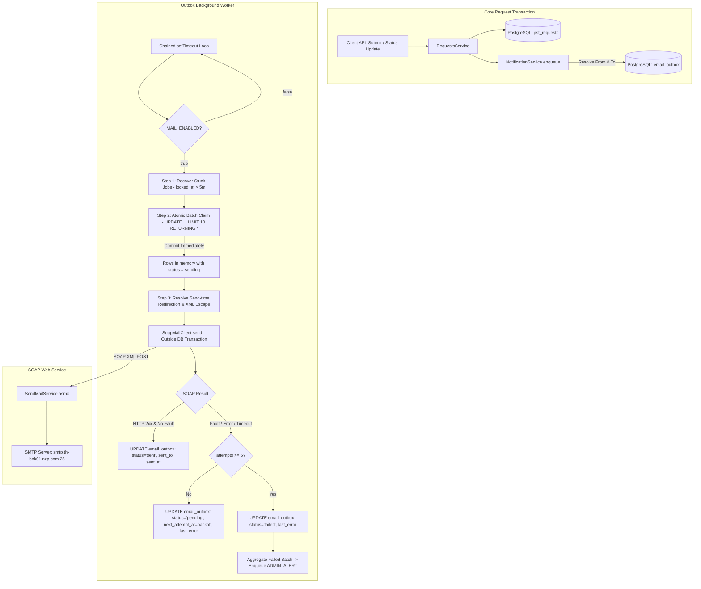

# Design Specification: Email Notification System (SOAP + Outbox)

> **Historical initial design.** The [accepted review](2026-10-05-email-notification-review.md)
> and [implemented behavior guide](../../email-notifications.md) supersede conflicting
> requirements below. From is fixed to `noreply-psf@nxp.com`; To/CC and suppression
> belong to the destination status, including submission and every bulk-replaced
> request. Role-driven recipient defaults and actor-driven From below are not
> the implemented policy. Company connectivity has not been exercised here.

- **Date:** 2026-10-05
- **Branch:** `feat/email-notification`
- **Scope:** Backend notification outbox, SOAP web service dispatch, email templates, workflow hooks, worker lifecycle, admin monitoring API, and security controls.
- **Reference Tasks:** GI-26 (Notification Outbox & Email Dispatch), Section 7 of `psf_setup_file_web_application_spec_en.md`.

---

## 1. Executive Summary & Delivery Semantics

The Email Notification System automatically dispatches emails to stakeholders (Requesters, Setup File Owners, and Administrators) upon PSF request submission, status changes, and system alerts.

### Key Guarantees & Constraints:
1. **Asynchronous Outbox Pattern:** All notification events are written into an `email_outbox` table inside the same PostgreSQL transaction as the business operation (`submitRequest`, `updateRequestStatus`). Sending is decoupled from request mutations.
2. **At-Least-Once Delivery Semantics:** The system provides at-least-once delivery. If a worker process or container terminates abruptly after the SOAP service receives the call but before the database transaction commits the `sent` status, the job may be re-claimed and resent after the `locked_at` timeout expires (5 minutes). Idempotency should be kept in mind by consumers.
3. **Transaction Isolation:** Failures during recipient resolution or outbox enqueue must never roll back user request writes or status transitions. When `MAIL_ENABLED=true`, `MAIL_DEFAULT_TO` is strictly required at startup. If no recipient can be found at runtime even after checking defaults, the enqueue step is safely skipped and a warning is logged.
4. **Non-Blocking SOAP Dispatch:** SOAP web service calls are executed strictly outside database transactions.
5. **Send-Time Redirection & Dev Safety:** In non-production environments, `MAIL_REDIRECT_TO` guarantees that no emails leave for real users. Redirection is applied strictly at dispatch time, preserving original intended recipients in database audit fields.
6. **Delivery Channel:** Dispatched through NXP internal `SendMailService.asmx` SOAP 1.1 Web Service (`POST http://.../MailService/SendMailService.asmx`) relaying to SMTP (`smtp.th-bnk01.nxp.com:25`).

---

## 2. High-Level Architecture & Data Flow



---

## 3. Database Schema (`email_outbox`)

The table captures the full lifecycle, recipient history, fallback flag, and error telemetry.

```sql
CREATE TABLE IF NOT EXISTS email_outbox (
    id UUID PRIMARY KEY DEFAULT gen_random_uuid(),
    event_type TEXT NOT NULL CHECK (event_type IN ('REQUEST_SUBMITTED', 'REQUEST_STATUS_CHANGED', 'ADMIN_ALERT', 'ADMIN_TEST')),
    request_id UUID REFERENCES psf_requests(id) ON DELETE SET NULL,
    from_address TEXT NOT NULL,
    to_recipients TEXT NOT NULL,
    cc_recipients TEXT,
    bcc_recipients TEXT,
    sent_to TEXT,
    subject TEXT NOT NULL,
    body_html TEXT NOT NULL,
    status TEXT NOT NULL DEFAULT 'pending' CHECK (status IN ('pending', 'sending', 'sent', 'failed')),
    is_fallback BOOLEAN NOT NULL DEFAULT FALSE,
    attempts INT NOT NULL DEFAULT 0,
    next_attempt_at TIMESTAMPTZ NOT NULL DEFAULT NOW(),
    locked_at TIMESTAMPTZ,
    last_error TEXT,
    sent_at TIMESTAMPTZ,
    created_at TIMESTAMPTZ NOT NULL DEFAULT NOW(),
    updated_at TIMESTAMPTZ NOT NULL DEFAULT NOW()
);

-- Polling index for pending jobs
CREATE INDEX IF NOT EXISTS idx_email_outbox_polling 
    ON email_outbox (status, next_attempt_at) 
    WHERE status = 'pending';

-- Stuck recovery index for zombie sending jobs
CREATE INDEX IF NOT EXISTS idx_email_outbox_stuck_recovery 
    ON email_outbox (status, locked_at) 
    WHERE status = 'sending';

-- Request linkage index
CREATE INDEX IF NOT EXISTS idx_email_outbox_request_id 
    ON email_outbox (request_id);

-- Admin pagination & fallback filter index
CREATE INDEX IF NOT EXISTS idx_email_outbox_admin_list 
    ON email_outbox (created_at DESC, status, is_fallback);
```

### Column Specifications:
- `from_address`: The email address of the actor who performed the action (or `MAIL_FROM` if missing).
- `to_recipients`, `cc_recipients`, `bcc_recipients`: The original intended recipients (comma-separated). Unmodified by dev redirection.
- `sent_to`: Complete audit string of actual destination addresses used during SOAP dispatch (e.g. `To: kasidet...; CC: danunan...`).
- `is_fallback`: `TRUE` if the notification could not resolve target stakeholder emails and had to be routed to `MAIL_DEFAULT_TO`.
- `locked_at`: Timestamp recorded when atomically claimed for sending. Used for 5-minute zombie recovery.
- `last_error`: The first line of `faultstring` or network exception, decoded from XML entities, stripped of stack traces, capped at 500 characters.

---

## 4. SOAP Web Service Contract & XML Escaping

### 4.1 Endpoint & Required HTTP Headers
- **Method:** `POST`
- **URL:** `${MAIL_SOAP_URL}` (e.g. `http://thgbnklak1ms170.wbi.nxp.com/MailService/SendMailService.asmx`)
- **Headers:**
  - `Content-Type: text/xml; charset=utf-8`
  - `SOAPAction: "http://tempuri.org/SendMail"`

### 4.2 XML Escaping Rules
Every field passed outside CDATA blocks (`i_strSystemName`, `i_strServer`, `i_strPort`, `i_strFrom`, `i_strTo`, `i_strCC`, `i_strBCC`, `i_strSubject`) **MUST** be strictly XML-escaped:
- `&` → `&amp;`
- `<` → `&lt;`
- `>` → `&gt;`
- `"` → `&quot;`
- `'` → `&apos;`

### 4.3 CDATA Escaping
The email HTML body is placed inside `<i_strBody><![CDATA[ ... ]]></i_strBody>`.
If the body string contains the literal sequence `]]>`, it must be escaped as `]]]]><![CDATA[>` to avoid breaking the CDATA enclosure.

### 4.4 SOAP XML Payload Structure
```xml
<?xml version="1.0" encoding="utf-8"?>
<soap:Envelope
  xmlns:xsi="http://www.w3.org/2001/XMLSchema-instance"
  xmlns:xsd="http://www.w3.org/2001/XMLSchema"
  xmlns:soap="http://schemas.xmlsoap.org/soap/envelope/">
  <soap:Body>
    <SendMail xmlns="http://tempuri.org/">
      <i_strSystemName>${xmlEscape(MAIL_SYSTEM_NAME)}</i_strSystemName>
      <i_strServer>${xmlEscape(MAIL_SMTP_SERVER)}</i_strServer>
      <i_strPort>${xmlEscape(MAIL_SMTP_PORT)}</i_strPort>
      <i_strFrom>${xmlEscape(fromAddress)}</i_strFrom>
      <i_strTo>${xmlEscape(actualTo)}</i_strTo>
      <i_strCC>${xmlEscape(actualCc)}</i_strCC>
      <i_strBCC>${xmlEscape(actualBcc)}</i_strBCC>
      <i_strSubject>${xmlEscape(subject)}</i_strSubject>
      <i_strBody><![CDATA[${cdataEscape(htmlBody)}]]></i_strBody>
    </SendMail>
  </soap:Body>
</soap:Envelope>
```

### 4.5 SOAP Response Handling & Success Detection
1. **Success Criteria:**
   - HTTP response status is `2xx` (specifically `200 OK`).
   - Response XML contains `<SendMailResponse xmlns="http://tempuri.org/"` (can be empty / self-closing).
   - Response does **not** contain `<soap:Fault>`.
   - *(Note: SendMailService returns an empty `<SendMailResponse />` tag without `<SendMailResult>` upon success).*
2. **Failure Criteria:**
   - HTTP status is non-`2xx` (e.g. `500 Internal Server Error`).
   - Response contains `<soap:Fault>`.
   - Connection timeout (exceeding `MAIL_TIMEOUT_MS`, default: 10,000 ms), network error, or invalid XML.
3. **Error Parsing & XML Entity Decoding:**
   - On fault, extract `<faultstring>` from XML.
   - Decode XML entities (e.g. `&gt;` → `>`, `&lt;` → `<`, `&amp;` → `&`, `&quot;` → `"`).
   - Extract only the first line (e.g. `System.Net.Mail.SmtpException: Syntax error in parameters or arguments`).
   - Truncate to at most 500 characters and write to `last_error`.
   - Log the complete raw fault and stack trace to server logs.

---

## 5. Sender (From) & Recipient Rules

### 5.1 Sender (`from_address`) Rules
1. **Action-Driven From Address:** `from_address` is the authenticated email of the actor performing the action:
   - Request submitter email on `submitRequest`.
   - Updating user's email on `updateRequestStatus`.
   - Triggering admin's email on test endpoints.
2. **Fallback to `MAIL_FROM`:** If the acting user has no email configured (e.g. mock development identities where `email = NULL`), fall back to `MAIL_FROM`.
3. **Production Standard:** In production, `MAIL_FROM` must be configured as a generic system/no-reply mailbox (e.g. `no-reply.psf@nxp.com`), not a personal employee email.
4. **Redirection Preservation:** When `MAIL_REDIRECT_TO` is active, `from_address` remains unchanged. Only recipient addresses are redirected. The test banner displays the original `from_address`.
5. **No Custom Automated Footer:** The backend template must **not** add an "automated message" footer. The SOAP web service already automatically appends:
   `"This is sent from system, please don't reply directly"`
   *(Note: This creates a conceptual conflict with using a real person's email as From; see Open Question §12).*

### 5.2 Recipient Resolution Rules *(Business Assumptions)*
> [!IMPORTANT]
> The following recipient mappings are current baseline assumptions based on specification documents. They must be formally confirmed with business process owners prior to production rollout.

1. **Submission Notification (`REQUEST_SUBMITTED`):**
   - **To:** All users with role `setup_owner` (both GNTC and MFG departments) having non-empty `email`.
   - **CC:** None.
2. **Status Change Notification (`REQUEST_STATUS_CHANGED`):**
   - **To:** The original `requester` user email.
   - **CC:** The assigned Setup Owner email (if assigned), or all Setup Owners if unassigned.
3. **Fallback Handling (`is_fallback = true`):**
   - If recipient resolution yields no valid emails for a notification:
     - Route the email to `MAIL_DEFAULT_TO` (admin mailbox).
     - Set `is_fallback = TRUE` in `email_outbox`.
     - Inject a prominent top warning banner into the HTML body:
       `"ไม่พบอีเมลผู้รับสำหรับ event นี้ กรุณาตรวจสอบข้อมูลผู้ใช้ (ผู้รับที่ควรได้รับ: {role})"`
4. **Safety Enqueue Guard:**
   - If even `MAIL_DEFAULT_TO` is empty or invalid when resolving fallback, **do not throw an error and do not fail the business transaction**. Log a `warn` message and skip outbox insertion.

### 5.3 Send-Time Redirection (`MAIL_REDIRECT_TO`)
Applied **strictly at send time** inside the worker (never at enqueue time):
- When `MAIL_REDIRECT_TO` is populated:
  - Actual `To` sent to SOAP = `MAIL_REDIRECT_TO`.
  - Actual `CC` sent to SOAP = `""`.
  - Actual `BCC` sent to SOAP = `""`.
  - Subject prepends `[TEST] ` (subject in database remains clean without `[TEST]`).
  - Prepend a prominent test banner to the HTML body:
    ```html
    <div style="background-color: #fff3cd; color: #856404; padding: 12px; border: 1px solid #ffeeba; margin-bottom: 16px; border-radius: 4px;">
      <strong>[TEST ENVIRONMENT REDIRECTION]</strong><br/>
      Sender: <code>${from_address}</code><br/>
      Original To: <code>${to_recipients}</code><br/>
      Original CC: <code>${cc_recipients || '-'}</code>
    </div>
    ```
  - Record complete recipient log in `sent_to` (e.g. `To: kasidet...; CC: danunan...`).
- When `MAIL_REDIRECT_TO` is empty:
  - Actual `To` = `to_recipients`, Actual `CC` = `cc_recipients`.
  - `sent_to` recorded as `To: ${to_recipients}; CC: ${cc_recipients || '-'}`.

---

## 6. Email Content & View Request Link

### 6.1 Event Subjects (Clean, Unprefixed in Database)
1. **Submission:** `[PSF Request] New Request: {requestNo} - {title}`
2. **Status Changed (Open kind):** `[PSF Request] Status Updated to {newStatus}: {requestNo} - {title}`
3. **Completed (`kind === 'completed'`):** `[PSF Request] Completed: {requestNo} - {title}`
4. **Cancelled (`kind === 'cancelled'`):** `[PSF Request] Cancelled: {requestNo} - {title}`
5. **Admin Alert:** `[PSF System Alert] Notification Delivery Failures: {count} failed`

### 6.2 Body Structure & Information Hiding
- **Header:** System brand header (`PSF Setup File Request Management`).
- **Summary Statement:** Explains the current action in context.
- **Request Metadata Table:**
  - Request No, Title, Requester, Product Type, Priority, Due Date
  - Previous Status → New Status
  - Updated By: `{actorName} ({actorRole})` *(Retained because SOAP service displays a generic system sender name rather than individual names).*
  - Reason / Remarks: Included only if status is Cancelled/Rejected and reason metadata is present.
- **Security Constraint:** **PSF Created Information is NEVER included in emails.** Unreleased engineering data cannot leak.
- **HTML Escaping:** All dynamic user inputs are strictly HTML-escaped. Null/empty fields display as `"-"`.

### 6.3 "View Request" Button & SPA Routing Requirements
- Button links directly to `${APP_BASE_URL}/requests/${requestId}`.
- **Authentication & Deep Linking:**
  - If an unauthenticated user opens the link, the frontend route guard must store the target URL (`returnUrl`) in session/query and redirect to `/login`.
  - Upon successful LDAP login, the user must be redirected back to `${APP_BASE_URL}/requests/${requestId}`.
  - If the authenticated user does not have permission to view the request, render a clean, explicit `403 Forbidden` page.
- **Nginx / Web Server SPA Fallback:**
  - The production web server (Nginx/IIS) serving the frontend SPA must be configured with fallback routing (`try_files $uri $uri/ /index.html;`) so that direct navigation or browser refresh on `/requests/:id` does not return `404 Not Found`.

---

## 7. Outbox Background Worker, Retries & Admin Alerts

### 7.1 Non-Overlapping Polling Loop
- Uses chained `setTimeout` with a boolean mutex flag (`isRunning`):
  ```typescript
  async function pollLoop() {
    if (isRunning) return;
    isRunning = true;
    try {
      await processOutboxBatch();
    } catch (err) {
      logger.error('Worker error', err);
    } finally {
      isRunning = false;
      timeoutHandle = setTimeout(pollLoop, pollIntervalMs);
    }
  }
  ```

### 7.2 `MAIL_ENABLED` Toggle Behavior
- **When `MAIL_ENABLED=false`:**
  - Mutation endpoints continue to insert outbox records in `status = 'pending'`.
  - The worker poll loop immediately sleeps without running database queries.
- **When toggled from `false` to `true`:**
  - On the very next poll tick, the worker picks up all pending records accumulated in `email_outbox` where `next_attempt_at <= NOW()` and processes them in FIFO order. No jobs are lost.

### 7.3 Step 1: Zombie Recovery (`locked_at`)
Before claiming new jobs, recover jobs stuck in `sending` due to server crashes:
```sql
UPDATE email_outbox
SET status = 'pending',
    locked_at = NULL,
    updated_at = NOW()
WHERE status = 'sending'
  AND locked_at < NOW() - INTERVAL '5 minutes';
```

### 7.4 Step 2: Atomic Batch Claiming
Claims up to 10 rows and updates their status in a single atomic SQL statement, committing immediately:
```sql
UPDATE email_outbox
SET status = 'sending',
    locked_at = NOW(),
    attempts = attempts + 1,
    updated_at = NOW()
WHERE id IN (
    SELECT id
    FROM email_outbox
    WHERE status = 'pending'
      AND next_attempt_at <= NOW()
    ORDER BY next_attempt_at ASC
    LIMIT 10
    FOR UPDATE SKIP LOCKED
)
RETURNING id, event_type, request_id, from_address, to_recipients, cc_recipients, 
          bcc_recipients, subject, body_html, attempts;
```

### 7.5 Step 3: Dispatch & Exponential Backoff
For each claimed job (executed in Node.js outside SQL transaction):
1. Format actual recipients and apply dev redirection if configured.
2. Call `SoapMailClient.send(...)`.
3. **If Successful:**
   ```sql
   UPDATE email_outbox
   SET status = 'sent',
       sent_to = $2,
       sent_at = NOW(),
       locked_at = NULL,
       last_error = NULL,
       updated_at = NOW()
   WHERE id = $1;
   ```
4. **If Failed:**
   - Decode XML error and extract first line (max 500 chars).
   - If `attempts < 5`:
     ```sql
     UPDATE email_outbox
     SET status = 'pending',
         locked_at = NULL,
         last_error = $2,
         next_attempt_at = NOW() + $3::interval,
         updated_at = NOW()
     WHERE id = $1;
     ```
     *Backoff intervals:* 1m (attempt 1), 5m (attempt 2), 15m (attempt 3), 60m (attempt 4).
   - If `attempts >= 5`:
     ```sql
     UPDATE email_outbox
     SET status = 'failed',
         locked_at = NULL,
         last_error = $2,
         updated_at = NOW()
     WHERE id = $1;
     ```

### 7.6 Admin Failure Alerts (`ADMIN_ALERT`)
When jobs transition to `status = 'failed'`:
1. **Batch Aggregation:** If multiple jobs fail in the same worker run, aggregate them into a single `ADMIN_ALERT` notification rather than spamming multiple alert emails.
2. **Alert Content:** Summary table containing Request No, Event Type, Original Recipients, Attempts count, and `last_error`. **Does not include original `body_html`.**
3. **Recipient:** Sent to `MAIL_DEFAULT_TO` (subject to `MAIL_REDIRECT_TO` if active).
4. **Loop Prevention:** If an `ADMIN_ALERT` job itself fails, **it must never create another `ADMIN_ALERT`**.
5. **System Failure Notice:** If the SOAP service or network is completely down, `ADMIN_ALERT` emails will also fail to deliver. The specification explicitly dictates that administrators must rely on server error logs and the Admin GET API for monitoring during service outages.

---

## 8. Admin Guard & Management APIs

### 8.1 Admin Guard Specification
- Protects all `/api/admin/notifications/*` routes.
- **Session Check:** Verifies `request.session.userId`.
- **Database Role Check:** Loads profile via `AuthService.getProfile(userId)` and verifies `role === 'admin'`.
- **Optional LDAP Group Check:** If `ADMIN_LDAP_GROUP` is configured in `.env`, the guard or LDAP login flow verifies that the user belongs to the designated directory group.
- Unauthorized callers receive `401 Unauthorized`; non-admin callers receive `403 Forbidden`.

### 8.2 Endpoints

#### 1. List Outbox Notifications (Paginated)
- **Route:** `GET /api/admin/notifications`
- **Query Parameters:**
  - `page` (number, default: 1)
  - `limit` (number, default: 20, max: 100)
  - `status` (optional: `'pending' | 'sending' | 'sent' | 'failed'`)
  - `isFallback` (optional boolean: filter fallback deliveries)
- **Behavior:**
  - **Excludes `body_html`** from query to maintain lightweight responses.
  - Returns `created_at DESC` order.
- **Response Format:**
  ```json
  {
    "items": [
      {
        "id": "c71a3962-e6bb-4934-8c88-e925bf157774",
        "eventType": "REQUEST_SUBMITTED",
        "requestId": "92f7680a-9d90-4131-b753-1e56b464ad19",
        "fromAddress": "dev.requester@nxp.com",
        "to": "dev.setup-gntc@nxp.com, dev.setup-mfg@nxp.com",
        "cc": null,
        "sentTo": "To: kasidet.watthanaphonphairot@nxp.com, danunan.maliyan@nxp.com",
        "subject": "[PSF Request] New Request: PSF-2026-0001 - Setup File Title",
        "status": "sent",
        "isFallback": false,
        "attempts": 1,
        "nextAttemptAt": "2026-10-05T03:00:00.000Z",
        "lockedAt": null,
        "lastError": null,
        "sentAt": "2026-10-05T03:00:02.000Z",
        "createdAt": "2026-10-05T03:00:00.000Z"
      }
    ],
    "total": 1,
    "page": 1,
    "limit": 20
  }
  ```
  *(Note: Notice that the database `subject` does NOT contain `[TEST]`, and `sentTo` reflects the full redirect list).*

#### 2. Resend Failed Notification
- **Route:** `POST /api/admin/notifications/:id/resend`
- **Behavior:**
  - **Allowed ONLY for rows with `status = 'failed'`.**
  - If status is not `'failed'`, returns `400 Bad Request` (`"Only failed notifications can be reset for resending"`).
  - Resets: `status = 'pending'`, `attempts = 0`, `next_attempt_at = NOW()`, `last_error = NULL`, `locked_at = NULL`.
- **Response:** Updated notification summary.

#### 3. Immediate Test Email
- **Route:** `POST /api/admin/notifications/test`
- **Behavior:**
  - Rejects with `BadRequestException("Mail service is disabled (MAIL_ENABLED=false)")` if `MAIL_ENABLED=false`.
  - Dispatches a fixed, safe, pre-defined test template (`"PSF Setup File - SOAP Email Test"`). Does not accept arbitrary caller HTML bodies to prevent open relay abuse.
  - Applies send-time redirection (`MAIL_REDIRECT_TO` if active).
  - Immediately dispatches via `SoapMailClient`.
  - Records an outbox entry with `event_type = 'ADMIN_TEST'` and final status (`sent` or `failed`).
- **Response Format:**
  ```json
  {
    "success": true,
    "sentTo": "To: kasidet.watthanaphonphairot@nxp.com, danunan.maliyan@nxp.com",
    "message": "Test email sent successfully",
    "outboxId": "uuid..."
  }
  ```

---

## 9. Environment Configuration & Validation

### 9.1 `.env.example`
```env
# ------------------------------------------------------------------------------
# Mail & Notification Configuration (SOAP Web Service + Outbox)
# ------------------------------------------------------------------------------
# Enable or disable background email dispatch worker
MAIL_ENABLED=true

# NXP Internal SendMail SOAP Web Service URL
MAIL_SOAP_URL=http://thgbnklak1ms170.wbi.nxp.com/MailService/SendMailService.asmx

# System sender identifier in SOAP payload
MAIL_SYSTEM_NAME="PSF Setup File"

# Internal SMTP Server relay configuration for SOAP payload
MAIL_SMTP_SERVER=smtp.th-bnk01.nxp.com
MAIL_SMTP_PORT=25

# System fallback sender mailbox (Production should use a system mailbox, not a personal email)
MAIL_FROM=no-reply.psf@nxp.com

# Administrator mailbox for alerts and fallback notifications (comma-separated if multiple)
MAIL_DEFAULT_TO=kasidet.watthanaphonphairot@nxp.com,danunan.maliyan@nxp.com

# Safe redirection in development/testing (comma-separated).
# If set, ALL outgoing emails (including fallback & alerts) are sent strictly to these addresses.
MAIL_REDIRECT_TO=kasidet.watthanaphonphairot@nxp.com,danunan.maliyan@nxp.com

# Worker polling interval (milliseconds)
MAIL_POLL_INTERVAL_MS=15000

# SOAP request timeout (milliseconds)
MAIL_TIMEOUT_MS=10000

# Frontend application base URL for deep links (Placeholder; do not use localhost/127.0.0.1 in production)
APP_BASE_URL=https://psf-app.nxp.com

# Optional LDAP Admin Group for Admin Guard verification
ADMIN_LDAP_GROUP=
```

### 9.2 Startup Configuration Validation (`mail.config.ts`)
When the NestJS application boots:
1. If `MAIL_ENABLED=true`:
   - `MAIL_SOAP_URL`, `MAIL_SMTP_SERVER`, `MAIL_SMTP_PORT`, `MAIL_FROM`, `MAIL_DEFAULT_TO`, and `APP_BASE_URL` are strictly required. If any are missing, startup throws a fatal configuration error.
   - If `MAIL_REDIRECT_TO` is empty (production mode):
     - `APP_BASE_URL` **must not** contain `localhost` or `127.0.0.1`.
     - Validates that `MAIL_FROM` conforms to email syntax.

---

## 10. Module Structure (`backend/src/notifications/`)

```
backend/src/notifications/
├── notifications.module.ts              # NestJS module definition
├── mail.config.ts                      # Validated environment configuration service
├── soap-mail.client.ts                 # SOAP XML builder, CDATA/XML escaper & HTTP client
├── mail.service.ts                     # Dispatcher handling send-time redirection & audit logging
├── email-templates.ts                  # Pure template functions for subjects, bodies, and banners
├── recipient-resolver.ts               # Logic determining To/CC from actor and database profiles
├── notification.service.ts             # Enqueues outbox records within caller DB transactions
├── outbox.worker.ts                    # Non-overlapping worker (chained setTimeout, recovery, claim)
├── notifications.controller.ts         # Admin-only endpoints (list, resend, test)
└── __tests__/
    ├── soap-mail.client.spec.ts        # Unit tests for XML escaping, response parsing, and fault decoding
    ├── email-templates.spec.ts         # Unit tests for HTML escaping, fallback banners, and layout
    ├── recipient-resolver.spec.ts      # Unit tests for profile lookup and fallback to MAIL_DEFAULT_TO
    ├── mail.config.spec.ts             # Unit tests for startup validation and production localhost rejection
    ├── outbox.worker.spec.ts           # Unit tests for atomic claim, locked_at recovery, backoff & alert aggregation
    └── notifications.controller.spec.ts# Unit tests for admin guard, resend restrictions & test endpoint
```

---

## 11. Verification & Testing Strategy

### 11.1 Unit Tests (Jest)
1. **`soap-mail.client.spec.ts`:**
   - Validates that all non-CDATA fields are XML-escaped (`&`, `<`, `>`, `"`, `'`).
   - Validates that `]]>` in CDATA is properly escaped to `]]]]><![CDATA[>`.
   - Simulates `HTTP 200` with empty `<SendMailResponse />` -> returns success.
   - Simulates `HTTP 500` with `<soap:Fault>` -> decodes XML entities, extracts first line of `faultstring`, truncates to 500 chars.
   - Simulates request timeout via `AbortSignal.timeout`.
2. **`mail.config.spec.ts`:**
   - Rejects missing `MAIL_DEFAULT_TO` when `MAIL_ENABLED=true`.
   - Rejects `APP_BASE_URL` with `localhost`/`127.0.0.1` when `MAIL_REDIRECT_TO` is empty.
3. **`recipient-resolver.spec.ts`:**
   - Resolves actor email as `from_address`, falling back to `MAIL_FROM` if actor email is null.
   - Fallback to `MAIL_DEFAULT_TO` with `is_fallback = true` when target users lack emails.
4. **`outbox.worker.spec.ts`:**
   - Tests backoff interval logic (1m, 5m, 15m, 60m).
   - Tests `locked_at` reset logic for entries older than 5 minutes.
   - Tests `ADMIN_ALERT` aggregation: verifies that when multiple jobs reach `failed` status, a single aggregated alert is created without recursion.
5. **`requests.service.spec.ts` Integration:**
   - Confirms `submitRequest` and `updateRequestStatus` call `notificationService.enqueue`.
   - Confirms that if outbox enqueue encounters a missing recipient, it does not throw or abort the request transaction.

### 11.2 Database Integration Tests (`@electric-sql/pglite`)
- Because PGlite operates over a single in-process connection, tests will verify single-connection sequential semantics:
  - Table initialization and constraints check (`status` and `event_type` enums).
  - Atomic claim query (`UPDATE ... WHERE id IN (SELECT ... FOR UPDATE SKIP LOCKED) RETURNING *`).
  - Stuck recovery query (`WHERE status = 'sending' AND locked_at < NOW() - INTERVAL '5 minutes'`).

### 11.3 Live End-to-End Smoke Test
- Execute `POST /api/admin/notifications/test` against the local development server.
- Verify receipt of email at `kasidet.watthanaphonphairot@nxp.com` and `danunan.maliyan@nxp.com`.
- Inspect outbox record to verify clean subject, `sent_to` audit value, and `ADMIN_TEST` event type.

---

## 12. Open Questions & IT Infrastructure Inquiries

The following technical questions should be reviewed with NXP IT / Network / Web Service administrators:

1. **SMTP Relay Sender Authentication (`From` Spoofing):**
   - *Question:* Does the internal SMTP relay server (`smtp.th-bnk01.nxp.com:25`) permit arbitrary employee email addresses in the `From` header (`i_strFrom`), or does SPF/relay security require that `From` match a designated service account?
   - *Impact:* If relay rejects non-service From addresses, all emails must use `MAIL_FROM` as `From` and populate the actor email in a `Reply-To` header (if supported by `SendMailService.asmx`).
2. **Automatic Footer Customization:**
   - *Question:* Is it possible to disable or modify the automatic footer (`"This is sent from system, please don't reply directly"`) appended by `SendMailService.asmx`?
   - *Impact:* Because the current design places the user's actual email in the `From` field, an unchangeable "please don't reply directly" footer may confuse recipients who wish to reply to the requester or engineer.
